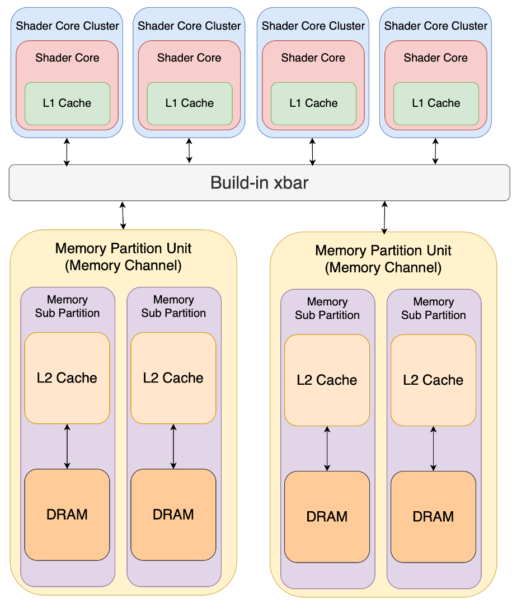
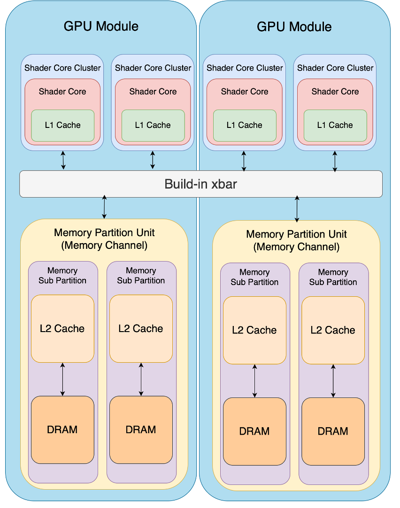
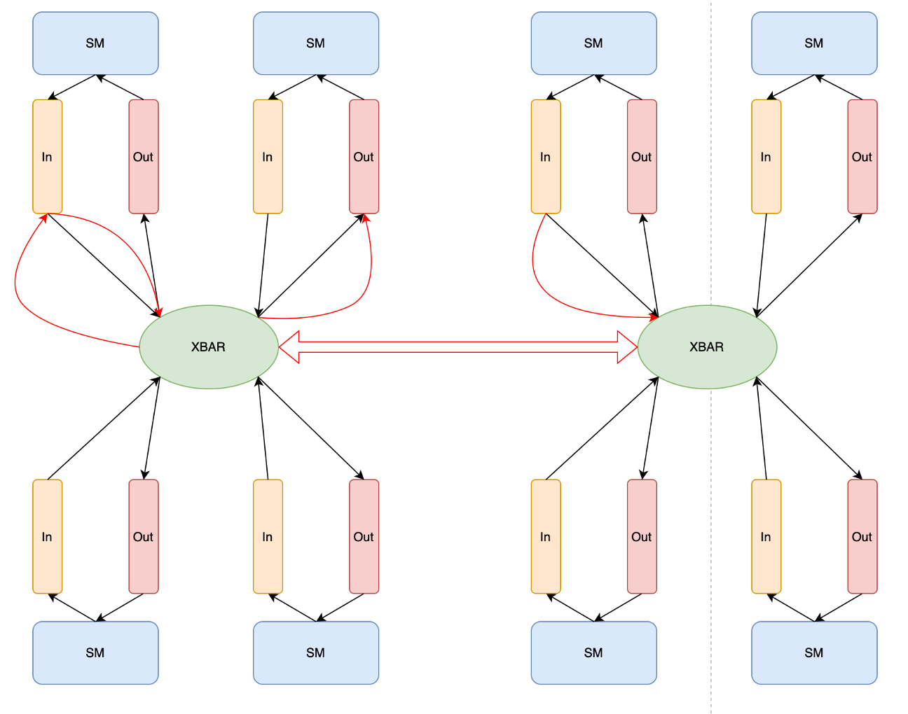

# Accel-Sim

* https://github.com/accel-sim/accel-sim-framework
* https://accel-sim.github.io
* http://gpgpu-sim.org/manual/index.php/Main_Page

## Script Running 

### Preparation for Accel-Sim

```bash
export CUDA_INSTALL_PATH=<your_cuda> 
export PATH=$CUDA_INSTALL_PATH/bin:$PATH å
source ./gpu-simulator/setup_environment.sh
```


### **Accel-Sim SASS Frontend and Simulation Engine**

**PS：** 运行Accel-Sim Simulation Engine前需要根据**Preparation for Accel-Sim**配置运行环境

#### run the workloads in Accel-Sim's SASS traces-driven mode

```bash
./util/job_launching/run_simulations.py -B $BENCHMARK_NAME -C $GPUCONFIG -T ./hw_run/traces/device-<device-num>/<cuda-version>/ -N $LAUNCHNAME
```

Eg.

```
./util/job_launching/run_simulations.py -B rodinia_2.0-ft -C QV100-SASS -T ./hw_run/rodinia_2.0-ft/11.0 -N myTest
```


**options introduction**

* `-B`：`--benchmark_list`，计划运行的一系列benchmark suit，在`apps/define-*.yml`中可以查看benchmark suit的名字
* `-C`：`--configs_list`，计划运行的GPU配置，在`configs/define-*.yml`中可以查看GPU配置
  * **Basefile Configs**包括*TITANX*，*TITANXX*，*RTX3070*，*RTX2060*，*QV100*，*QV100_SASS*等，为了保证配置的正确性，建议指定运行的config类型，例如`QV100-SASS or QV100-PTX`，同时Accel-sim提供一些可选的config，为了使用这些配置，需要使用`-`添加在Basefile Config后，例如`TITANX-L1ON-PTXPLUS`
* `-N`：`--launch_name`，用于命名该次启动，并确定Logfile的命名，如果没有确定该次启动的名字，那么该次启动将会被自动命名为当前的日期或者时间
* `-T`：`--trace_dir`，在*trace-driven mode*下将该选项传递给simulator，该选项应当是所有需要运行的trace file的根目录


#### run the workloads in Accel-Sim's PTX mode

```bash
./util/job_launching/run_simulations.py -B $BENCHMARK_NAME -C $GPUCONFIG -N $LAUNCHNAME
```

Eg.

```bash
./util/job_launching/run_simulations.py -B rodinia_2.0-ft -C QV100-PTX -N myTest
```

**PS：** 使用PTX mode运行Accel-Sim需要提前将所需benchmark suit进行编译，并且指定benchmark suit二进制的目录

```bash
make -j -C ./gpu-app-collection/src $BENCHMARK_NAME
make -C ./gpu-app-collection/src data 
export GPUAPPS_ROOT=$BINARYFILE_DIR
```


**options introduction**

* `-B`：`--benchmark_list`，计划运行的一系列benchmark suit，在`apps/define-*.yml`中可以查看benchmark suit的名字
* `-C`：`--configs_list`，计划运行的GPU配置，在`configs/define-*.yml`中可以查看GPU配置
  * **Basefile Configs**包括*TITANX*，*TITANXX*，*RTX3070*，*RTX2060*，*QV100*，*QV100_SASS*等，为了保证配置的正确性，建议指定运行的config类型，例如`QV100-SASS or QV100-PTX`，同时Accel-sim提供一些可选的config，为了使用这些配置，需要使用`-`添加在Basefile Config后，例如`TITANX-L1ON-PTXPLUS`
* `-N`：`--launch_name`，用于命名该次启动，并确定Logfile的命名，如果没有确定该次启动的名字，那么该次启动将会被自动命名为当前的日期或者时间


#### Monitor the Test

```bash
./util/job_launching/monitor_func_test.py -v -N $LAUNCHNAME
```


**options introduction**

* `-v`：`--verbose`，不断打印信息
* `-T`：`--timeout`，运行monitor的最大小时数，如果超过该时间，monitor将会退出并返回error code
* `-K`：`--killwhentimeout`，如果monitor出现timeout，则杀死所有仍在运行的job

---

# GPGPU-Sim

## Terminologies

1. `Shader_core` or `SIMT core`：**SM** in *Nvidia* and **CU** in *AMD*

> In GPGPU-Sim 3.x, an SIMT core models a highly multithreaded pipelined SIMD processor roughly equivalent to what NVIDIA calls an Streaming Multiprocessor (SM) [[1\]](http://developer.nvidia.com/nvidia-gpu-computing-documentation) or what AMD calls a Compute Unit (CU) [[2\]](http://developer.amd.com/gpu_assets/GPU Computing - Past Present and Future with ATI Stream Technology.pdf). A Stream Processor (SP) or a CUDA Core would correspond to a lane within an ALU pipeline in the SIMT core.
>
> [GPGPU-Sim manual #SIMT_Cores](http://gpgpu-sim.org/manual/index.php/Main_Page#SIMT_Cores)

2. `SIMT Core Cluster`

> The SIMT Cores in a SIMT Core Cluster share a common port to the interconnection network.
>
> [GPGPU-Sim manual #SIMT_Cores](http://gpgpu-sim.org/manual/index.php/Main_Page#SIMT_Core_Clusters)

默认情况下，每一个SIMT Core Cluster中包含一个SIMT core，即`m_config->n_simt_cores_per_cluster == 1`


## Interconnect

> We developed a fast built-in xbar interconnect instead of the complex Booksim-based xbar so the user can have more control and understanding of the interconnect. The user can switch between the built-in xbar and Booksim interconnect. The built-in xbar is a standard crossbar with iSLIP arbitration






**Accel-Sim**使用了built-in xbar interconnect来代替Booksim-based xbar，但是built-in xbar并没有涉及不同node间的传输代价，因此我向built-in xbar中添加了interconnect latency。除此以外，由于GPGPUSim仅支持monolithic GPU simulation，为了模拟Multi-Chip-Module GPU，我在accel-sim的cluster层上添加了一层GPU Module并添加了对应的interconnect




## DRAM

``` 
-gpgpu_dram_timing_opt nbk:tCCD:tRRD:tRCD:tRAS:tRP:tRC:CL:WL:tCDLR:tWR
```

* nbk: number of banks
* tCCD: Column to Column Delay (RD/WR to RD/WR different banks)
* tRRD: Row to Row Delay (Active to Active different banks)
* tRCD: Row to Column Delay (Active to RD/WR/RTR/WTR/LTR)
* tRAS: Active to PRECHARGE command period
* tRP: PRECHARGE command period 
* tRC: Active to Active command period (same bank)
* CL: CAS Latency (Column address strobe latency, also called CAS latency or CL, is **the delay in clock cycles between the READ command and the moment data is available**)
* WL: WRITE latency
* tCDLR: Last data-in to Read Delay (switching from write to read)
* tWR: WRITE recovery time


```
-gpgpu_mem_addr_mapping dramid@<start bit>;<memory address map>
```

Mapping memory address to DRAM model:

* <start bit> = where the bits used to specify the DRAM channel ID starts. (This means the next Log2(#DRAM channel) bits will be used as the DRAM channel ID, and the whole address map will be shifted depending on how many bits are used.)
* <memory address map> = a 64-character string specify how each bit in a memory address is decoded into row (R), column (C), bank (B) addresses. Part of the address that will be inside a single DRAM burst should be specified with (S).


```
for HBM, three stacks, 24 channles, each (128 bits) 16 bytes width
```

> **High Bandwidth Memory** (**HBM**) is a [computer memory](https://en.wikipedia.org/wiki/Computer_memory) interface for [3D-stacked](https://en.wikipedia.org/wiki/Three-dimensional_integrated_circuit) [synchronous dynamic random-access memory](https://en.wikipedia.org/wiki/Synchronous_dynamic_random-access_memory) (SDRAM) initially from [Samsung](https://en.wikipedia.org/wiki/Samsung_Electronics), [AMD](https://en.wikipedia.org/wiki/Advanced_Micro_Devices) and [SK Hynix](https://en.wikipedia.org/wiki/SK_Hynix).
>
> source: https://en.wikipedia.org/wiki/High_Bandwidth_Memory


**In terms of DRAM Size**：

* https://github.com/gpgpu-sim/gpgpu-sim_distribution/issues/71
* https://github.com/gpgpu-sim/gpgpu-sim_distribution/pull/133
* https://github.com/MaxKev1n/gpgpu-sim_distribution/commit/950464e7f8e512f2beb0c9e0883db3489bf84cec
* 由这两个issue和一个commit可以基本判断DRAM Size仅由使用的`address_type`的类型长度决定
