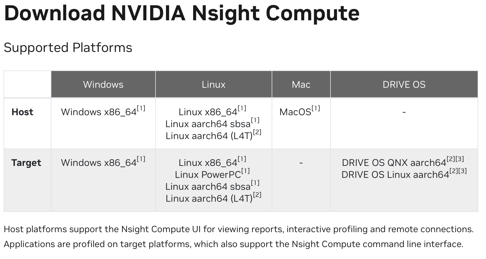

# GPGPU-arch-learning

这是参考[Dr.Zhouyaoyang](https://github.com/shinezyy)的建立的[micro-arch-training](https://github.com/shinezyy/micro-arch-training)和[Zihang CHEN](https://github.com/MaxKev1n)建立的[micro-arch-learning](https://github.com/MaxKev1n/micro-arch-learning)，关于如何入门GPGPU architecture以及相关tools使用的仓库

> micro-arch-learning的仓库只是一个学习过程的记录，并不是用于解答micro-arch-training的答案。micro-arch-training建立的目的并不是解决问题本身，而是学习解决过程的方法，成为一个**independent researcher**。


> How to make undergraduates or new graduates ready for advanced computer architecture research or modern CPU design. 本项目的目的是让本科生或新入学的研究生迅速地可以参加体系结构研究或参与高性能处理器开发。
>
> ——@shinezyy


## MGPUSim

**推荐课程：**[W&M CSCI780-01 Spring 23 Computer Arch. Mdl and Sim (notion.site)](https://syifan.notion.site/W-M-CSCI780-01-Spring-23-Computer-Arch-Mdl-and-Sim-a5102523b841499dbbd0ff893f8495a6)

**MGPUSim**: [Akita / MGPUSim · GitLab](https://gitlab.com/akita/mgpusim)

**citation**:

```
@inproceedings{sun19mgpusim, 
    author = {Sun, Yifan and Baruah, Trinayan and Mojumder, Saiful A. and Dong, Shi and Gong, Xiang and Treadway, Shane and Bao, Yuhui and Hance, Spencer and McCardwell, Carter and Zhao, Vincent and Barclay, Harrison and Ziabari, Amir Kavyan and Chen, Zhongliang and Ubal, Rafael and Abell\'{a}n, Jos\'{e} L. and Kim, John and Joshi, Ajay and Kaeli, David}, 
    title = {MGPUSim: Enabling Multi-GPU Performance Modeling and Optimization}, 
    year = {2019}, 
    isbn = {9781450366694}, 
    publisher = {Association for Computing Machinery}, 
    address = {New York, NY, USA}, 
    url = {https://doi.org/10.1145/3307650.3322230}, 
    doi = {10.1145/3307650.3322230}, 
    booktitle = {Proceedings of the 46th International Symposium on Computer Architecture}, 
    pages = {197–209}, 
    numpages = {13}, 
    keywords = {simulation, multi-GPU systems, memory management}, 
    location = {Phoenix, Arizona}, 
    series = {ISCA '19} 
}
```


> ⚠️遇到../runner/timingplatform.go:19:2: gitlab.com/akita/noc/v3@v3.0.0-alpha.9: Get "https://proxy.golang.org/gitlab.com/akita/noc/v3/@v/v3.0.0-alpha.9.zip": dial tcp 172.217.163.49:443: i/o timeout类的问题？
>
> ```go
> go env -w GOPROXY=https://goproxy.io,direct
> ```


* **任务一：如何使用MGPUSim运行一个应用** ✅
* **任务二：如何使用MGPUSim运行一个GNN workload**
* **任务三：如何快速使用MGPUSim进行实验** ✅

---

## GCN

**推荐阅读资料**：

* https://tkipf.github.io/graph-convolutional-networks/


**参考代码**：https://github.com/tkipf/pygcn

**citation**

```
@article{kipf2016semi,
  title={Semi-Supervised Classification with Graph Convolutional Networks},
  author={Kipf, Thomas N and Welling, Max},
  journal={arXiv preprint arXiv:1609.02907},
  year={2016}
}
```


---

## CUDA

> ⚠️在HPC上使用**vscode**时可能遇到c++扩展无法正确工作：
>
> 1. 根据系统安装cuda（以CUDA 12.1为例）
>
> ```
> wget https://developer.download.nvidia.com/compute/cuda/12.1.1/local_installers/cuda_12.1.1_530.30.02_linux.run
> ```
>
> ```
> chmod 777 cuda_12.1.1_530.30.02_linux.run
> ```
>
> ```
> sh cuda_12.1.1_530.30.02_linux.run
> ```
>
> 2. 修改vscode的`c_cpp_properties.json`
>
> ```json
> {
>     "configurations": [
>         {
>             "name": "Linux",
>             "includePath": [
>                 "${workspaceFolder}/**",
>                 "/hpc/users/HKUST-GZ/zihangchen/cuda/cuda-11.4/include"
>             ],
>             "defines": [],
>             "compilerPath": "/usr/bin/gcc",
>             "cStandard": "c17",
>             "cppStandard": "gnu++14",
>             "intelliSenseMode": "linux-gcc-x64"
>         }
>     ],
>     "version": 4
> }
> ```
>
> 
>
> **参考资料**：https://blog.csdn.net/qq_35082030/article/details/110387800


* **任务一： 使用`cuda toolkit`编译`vecaddLoop.cu`得到`vecaddLoop.ptx`** ✅
* **任务二： 理解`vecaddLoop.ptx`** ✅
* **任务三： 使用`asm()`对`cube.cu`中的kernel插入Inline PTX Assembly** ✅

---

## Rodinia

**下载链接**：https://rodinia.cs.virginia.edu/doku.php?id=downloads

> ⚠️在HPC上使用`Rodinia`时可能遇到无法正常运行：
>
> 修改`rodinia_3.1/common/make.config`第二行
>
> ```makefile
> CUDA_DIR = /usr/local/cuda #original code
> ```
>
> ```makefile
> CUDA_DIR = /usr/local/cuda-11.4 #以module load cuda-11.4为例
> ```

---

## Performance Evaluation Methods

**citation:**

> Eeckhout, Lieven. “Computer Architecture Performance Evaluation Methods.” Synthesis Lectures on Computer Architecture, edited by Mark D Hill, Morgan & Claypool Publishers, 2010, doi:10.2200/S00273ED1V01Y201006CAC010.


### STP

We, first, define a program’s normalized progress as $NP_i=\frac{T_i^{SP}}{T_i^{MP}}$, with $T_i^{SP}$ and $T_i^{MP}$, the execution time undersingle-program mode (i.e.,the program runs in isolation) and multiprogram execution (i.e., the program co-runs with other programs), respectively. Given that a program runs slower under multiprogram execution, normalized progress is a value smaller than one. The intuitive understanding of normalized progress is that it represents a pro- gram’s progress during multiprogram execution. For example, an NP of 0.7 means that a program makes 7 milliseconds of single-program progress during a 10 millisecond time slice of multiprogram execution.

​		System throughput (STP) is then defined as the sum of the normalized progress rates across all jobs in the multiprogram job mix: $STP=\sum_{i=1}^nNP_i=\sum_{i=1}^n\frac{T_i^{SP}}{T_i^{MP}}$.
In other words, system throughput is the accumulated progress across all jobs, and thus it is a higher-is-better metric.


### ANTT

To define the average normalized turnaround time, we first define a program’s normalized turnaround time as $NTT_i=\frac{T_i^{MP}}{T_i^{SP}}$
Normalized turnaround time quantifies the user-perceived slowdown during multiprogram execution relative to single-program execution, and typically is a value larger than one. NTT is the reciprocal of NP. The average normalized turnaround time is defined as the arithmetic average across the programs’ normalized turnaround times: $ANTT=\frac{1}{n}\sum_{i=1}^nNTT_i=\frac{1}{n}\sum_{i=1}^n\frac{T_i^{MP}}{T_i^{SP}}$
ANTT is a lower-is-better metric. 

---

## Nsight Compute

### Nsight Compute UI

**参考资料：** https://developer.nvidia.com/tools-overview/nsight-compute/get-started

> **NCU 提供MacOS host版本**



* **任务一：如何生成Report并查看Source与PTX对应关系** ✅


### Nsight Compute CLI

**参考资料：** https://docs.nvidia.com/nsight-compute/NsightComputeCli/index.html#command-line-options-console-output


* **任务一：如何查看kernel的occupancy** ✅

* **任务二：如何查看cuda代码对应的sass代码** ✅


---

## Occupancy

* **任务一：如何在cuda代码中计算theoretical occupancy** ✅

---

## Accel-Sim

> Accel-Sim is a simulation framework for simulating and validating programmable accelerators like GPUs. For full details, please see our recent [ISCA 2020 paper](https://people.ece.ubc.ca/~aamodt/publications/papers/accelsim.isca2020.pdf) and download slides from [here](https://accel-sim.github.io/ISCA2020-presentation-v3.0.pptx).

* Introduction: The Accel-Sim ISCA 2020 paper [[paper](https://www.iscaconf.org/isca2020/papers/466100a473.pdf), [slides](https://accel-sim.github.io/ISCA2020-presentation-v3.0.pptx), [video](https://drive.google.com/drive/folders/1Q4-y6QTzS_1JoRmTUV31QKpOES9ZY8oG?usp=sharing)]
* Beginner guide and how to use: [Accel-Sim beginner manual](https://github.com/accel-sim/accel-sim-framework/blob/release/README.md)
* Accel-Sim per-component manuals: 
  - [Nvbit tracer](https://github.com/accel-sim/accel-sim-framework/blob/release/util/tracer_nvbit/README.md)
  - [Collecting HW stats](https://github.com/accel-sim/accel-sim-framework/blob/release/util/hw_stats/README.md)
  - [Collecting simulation stats](https://github.com/accel-sim/accel-sim-framework/blob/release/util/job_launching/README.md)
  - [Correlator](https://github.com/accel-sim/accel-sim-framework/blob/release/util/plotting/README.md)
  - [Tuner ](https://github.com/accel-sim/accel-sim-framework/tree/dev/util/tuner/README.md)
  - [Accel-Sim's Trace-driven front-end](https://github.com/accel-sim/accel-sim-framework/blob/dev/gpu-simulator/README.md)
* Performance model manual:
  - Original GPGPU-Sim 3.x manual [[manual](http://gpgpu-sim.org/manual/index.php/Main_Page), [slides](http://www.gpgpu-sim.org/micro2012-tutorial/), [tutorial videos](https://www.youtube.com/channel/UCMZLxSL7Ibn6uCvwdZcGqFQ/videos)] 
  - [GPGPU-Sim 4.x changes](https://github.com/accel-sim/accel-sim-framework/blob/dev/gpu-simulator/gpgpu-sim4.md)
* Power model manual:
  - [AccelWattch manual](https://accel-sim.github.io/accelwattch.html#manual)


> ⚠️在Ubuntu 22.04上使用可能遇到`gcc`版本等问题
>
> 建议使用Accel-Sim提供的[docker image](https://hub.docker.com/repository/docker/accelsim/ubuntu-18.04_cuda-11)


### Tasks

#### Basic Tasks

* **任务一： 尝试使用Accel-Sim trace-driven mode运行`rodinia_2.0`** ✅
* **任务二： 尝试使用Accel-Sim PTX mode运行`rodinia_2.0`** ✅
* **任务三： 尝试单独运行一个特殊的application**
* **任务四： 尝试监视Accel-Sim benchmark batch running** ✅

#### Advanced Tasks

* **任务一： 目前的Accel-Sim使用round-robin的方式决定*CTA*如何分配到*Streaming Multiprocessor*。尝试修改CTA的分配方式，不断分配CTA到同一个Streaming Multiprocessor上，直到该Streaming Multiprocessor无法放置更多的CTA** ✅


> **Citation：** 
>
> M. Khairy, Z. Shen, T. M. Aamodt和T. G. Rogers, 《Accel-Sim: An Extensible Simulation Framework for Validated GPU Modeling》, 收入 *2020 ACM/IEEE 47th Annual International Symposium on Computer Architecture (ISCA)*, Valencia, Spain: IEEE, 5月 2020, 页 473–486. doi: [10.1109/ISCA45697.2020.00047](https://doi.org/10.1109/ISCA45697.2020.00047).

---

## Git

**参考资料：**

* https://github.com/shinezyy/micro-arch-training#version-control
* https://zhuanlan.zhihu.com/p/526826127


版本控制的基本要求是学习以下命令的使用：

```
git add -p
git commit
git commit --amend
git checkout an-existing-branch
git checkout -b a-new-branch
git checkout path/to/a/file

git format-patch
git apply
git apply --check
git am

git rebase -i

git rm
git rm --cached

git fetch

git push

git merge a-branch
```


如果要参与复杂的开源项目开发，你或许还需要掌握这些命令：

```
git reset -p
git add -p
git checkout -p

git rebase a-branch
git rebase a-commit
git rebase --onto new-base-commit old-base-commit newest-modified-commit
git cherry-pick

git commit --fixup
```


⚠️记住：

- 不要用`git add .`，最好用`git add -p`
- 99%的情况，不要track log文件
- 99%的情况，不要track binary文件

---

