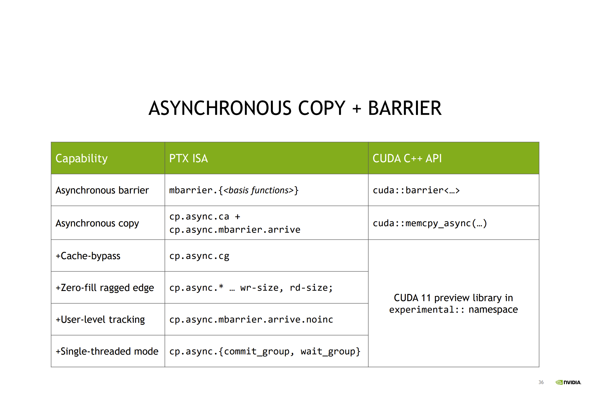

# Asynchronous Copy API

## cooperative_groups

### memcpy_async

```
cooperative_groups::memcpy_async(group, shared, global_in + batch_idx, sizeof(int) * block.size());
```

copies `sizeof(int) * block.size()` bytes from global memory starting at `global_in + batch_idx` to the `shared` data. This operation happens as-if performed by another thread, which synchronizes with the current thread’s call to `cooperative_groups::wait` after the copy has completed. 


> On devices with compute capability 8.0 or higher, `memcpy_async` transfers from global to shared memory can benefit from hardware acceleration, which avoids transfering the data through an intermediate register.


### wait and wait_prior

```
template <typename TyGroup>
void wait(TyGroup & group);

template <unsigned int NumStages, typename TyGroup>
void wair_prior(TyGroup & group);
```

`wait` and `wait_prior` collectives allow to wait for memcpy_async copies to complete. `wait` blocks calling threads until all previous copies are done. `wait_prior` allows that the latest NumStages are still not done and waits for all the previous requests. 


### For Example

```
while (global_index < N && offset < N) {
        fetchsize = (offset + blockSize < N) ? blockSize : N - offset;
        fetchsize = fetchsize >= 0 ? fetchsize : 0;

        cg::memcpy_async(tb, local_smem_a + blockSize * (stage ^ 1), a + offset, fetchsize * sizeof(double));
        cg::memcpy_async(tb, local_smem_b + blockSize * (stage ^ 1), b + offset, fetchsize * sizeof(double));

        cg::wait_prior<2>(tb);

        c[global_index] = local_smem_a[blockSize * stage + threadIdx.x] + local_smem_b[blockSize * stage + threadIdx.x];

        global_index += blockDim.x * gridDim.x;
        offset += blockDim.x * gridDim.x;
        stage ^= 1;
    }
```


## cuda::pipeline

### cuda::pipeline::producer_acquire()

> Acquires an available stage in the pipeline internal queue


### cuda::pipeline::producer_commit()

> Commits the asynchronous operations issued after the producer_acquire call on the currently acquired stage of the pipeline.


### cuda::pipeline::consumer_wait()

> Wait for completion of all asynchronous operations on the oldest stage of the pipeline.


### cuda::pipeline::consumer_release()

> Release the oldest stage of the pipeline to the pipeline object for reuse. The released stage can be then acquired by the producer.


### For Example

```
for (batch = 1; block_batch(batch) < N && block_batch(batch - 1) + threadIdx.x < N; batch++) {
        size_t compute_stage_idx = (batch - 1) % 2;
        size_t copy_stage_idx = batch % 2;

        pipeline.producer_acquire();
        cuda::memcpy_async(block, local_smem_a + shared_offset[copy_stage_idx], a + block_batch(batch),
                           sizeof(double) * fetchSize(block_batch(batch)), pipeline);
        cuda::memcpy_async(block, local_smem_b + shared_offset[copy_stage_idx], b + block_batch(batch),
                           sizeof(double) * fetchSize(block_batch(batch)), pipeline);
        pipeline.producer_commit();

        pipeline.consumer_wait();

        size_t global_idx = block_batch(batch - 1) + threadIdx.x;
        c[global_idx] = local_smem_a[block.size() * compute_stage_idx + threadIdx.x] +
                        local_smem_b[block.size() * compute_stage_idx + threadIdx.x];

        pipeline.consumer_release();
    }
```

---


