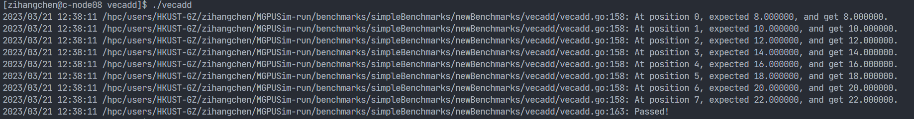

> 阅读MGPUSim文档：[doc/prepare_benchmarks.md · v3 · Akita / MGPUSim · GitLab](https://gitlab.com/akita/mgpusim/-/blob/v3/doc/prepare_benchmarks.md)

**WARNING**:ROCm从4.0版本开始升级了它们的编译器，因此最新的编译器编译的HSACO文件无法在MGPUSim上运行，推荐使用3.7版本的ROCm进行工作。建议使用docker image进行构建，[Image Layer Details - rocm/dev-ubuntu-18.04:3.7 | Docker Hub](https://hub.docker.com/layers/rocm/dev-ubuntu-18.04/3.7/images/sha256-58473c2bf947390fc1516d0c097e19a41baf1237ae843ca841853fdbc569b876?context=explore)




## Details（以`vecadd`为例）

**参考代码**：https://github.com/MaxKev1n/MGPUSim-run


1. 使用docker `room/dev-ubuntu-18.04:3.7`中的ROCm编译工具链对`kernels.cl`进行编译得到`.hsaco`文件

```opencl
__kernel void VECADD(global const float *inputA, global const float *inputB, 
                         global float *output){
    int gid = get_global_id(0);
    output[gid] = inputA[gid] + inputB[gid];
}
```

```
clang-ocl -mcpu=gfx803 kernels.cl -o kernels.hsaco
```

2. 编写`vecadd.go`文件描述benchmark工作过程

```go
package vecadd

import (
	"log"
	"math"

	// embed hsaco files
	_ "embed"

	"gitlab.com/akita/mgpusim/v3/driver"
	"gitlab.com/akita/mgpusim/v3/insts"
	"gitlab.com/akita/mgpusim/v3/kernels"
)

// KernelArgs defines kernel arguments
type KernelArgs struct {
	InputA              driver.Ptr //InputA，InputB，Output对应kernel中的三个参数inputA，inputB以及output
	InputB              driver.Ptr
	Output              driver.Ptr
	HiddenGlobalOffsetX int64 //HiddenGlobalOffsetXYZ为编译过程自带的参数
	HiddenGlobalOffsetY int64
	HiddenGlobalOffsetZ int64
}

// Benchmark defines a benchmark
type Benchmark struct {
	driver  *driver.Driver
	context *driver.Context
	queue   *driver.CommandQueue
	hsaco   *insts.HsaCo //读取hsaco文件
	gpus    []int

	inputDataA  []float32 //inputDataA和inputDataB为host端的数据
	inputDataB  []float32
	gInputDataA driver.Ptr //gInputDataA，gInputDataB和gOutputData为device端的数据
	gInputDataB driver.Ptr
	gOutputData driver.Ptr

	useUnifiedMemory bool
}

//go:embed kernels.hsaco
var hsacoBytes []byte

// NewBenchmark returns a benchmark
func NewBenchmark(driver *driver.Driver) *Benchmark {
	b := new(Benchmark)

	b.driver = driver
	b.context = b.driver.Init()
	b.queue = driver.CreateCommandQueue(b.context)

	b.hsaco = kernels.LoadProgramFromMemory(hsacoBytes, "VECADD") //读取hsaco中的函数名VECADD

	return b
}

// SelectGPU select GPU
func (b *Benchmark) SelectGPU(gpus []int) {
	b.gpus = gpus
}

// SetUnifiedMemory uses Unified Memory
func (b *Benchmark) SetUnifiedMemory() {
	b.useUnifiedMemory = true
}

// Run runs
func (b *Benchmark) Run() {
	b.driver.SelectGPU(b.context, b.gpus[0])
	b.initMem()
	b.exec()
	b.Verify()
}

func (b *Benchmark) initMem() {

	b.inputDataA = make([]float32, 8) //对inputDataA进行初始化
	for i := 0; i < 8; i++ {
		b.inputDataA[i] = float32(i)
	}

	b.inputDataB = make([]float32, 8) //对inputDataB进行初始化
	for i := 0; i < 8; i++ {
		b.inputDataB[i] = float32(i + 8)
	}

	if b.useUnifiedMemory { //对device端的gInputDataA等数据分配内存空间
		b.gInputDataA = b.driver.AllocateUnifiedMemory(
			b.context, uint64(32))
		b.gInputDataB = b.driver.AllocateUnifiedMemory(
			b.context, uint64(32))
		b.gOutputData = b.driver.AllocateUnifiedMemory(
			b.context, uint64(32))
	} else {
		b.gInputDataA = b.driver.AllocateUnifiedMemory(
			b.context, uint64(32))
		b.gInputDataB = b.driver.AllocateUnifiedMemory(
			b.context, uint64(32))
		b.driver.Distribute(b.context,
			b.gInputDataA, uint64(32), b.gpus)
		b.driver.Distribute(b.context,
			b.gInputDataB, uint64(32), b.gpus)
		b.gOutputData = b.driver.AllocateMemory(
			b.context, uint64(32))
		b.driver.Distribute(b.context,
			b.gOutputData, uint64(32), b.gpus)
	}

	b.driver.MemCopyH2D(b.context, b.gInputDataA, b.inputDataA) //将host端数据拷贝到device端
	b.driver.MemCopyH2D(b.context, b.gInputDataB, b.inputDataB)

}

func (b *Benchmark) exec() {
	queues := make([]*driver.CommandQueue, len(b.gpus))
	numWi := 8

	for i, gpu := range b.gpus {
		b.driver.SelectGPU(b.context, gpu)
		queues[i] = b.driver.CreateCommandQueue(b.context)

		kernArg := KernelArgs{
			b.gInputDataA,
			b.gInputDataB,
			b.gOutputData,
			int64(i * numWi / len(b.gpus)), 0, 0,
		}

		b.driver.EnqueueLaunchKernel(
			queues[i],
			b.hsaco,
			[3]uint32{uint32(numWi / len(b.gpus)), 1, 1},
			[3]uint16{256, 1, 1}, &kernArg,
		)
	}

	for i := range b.gpus {
		b.driver.DrainCommandQueue(queues[i])
	}
}

// Verify verifies
func (b *Benchmark) Verify() {
	gpuOutput := make([]float32, 8)
	b.driver.MemCopyD2H(b.context, gpuOutput, b.gOutputData)

	for i := 0; i < 8; i++ {
		var sum float32
		sum = 0

		sum = b.inputDataA[i] + b.inputDataB[i]

		if math.Abs(float64(sum-gpuOutput[i])) >= 1e-5 {
			log.Fatalf("At position %d, expected %f, but get %f.\n",
				i, sum, gpuOutput[i])
		} else {
			log.Printf("At position %d, expected %f, and get %f.\n",
				i, sum, gpuOutput[i])
		}
	}

	log.Printf("Passed!\n")
}
```

3. 编写`.go`启动文件，在`main()`函数中运行`vecadd.go`

```go
package main

import (
	"flag"

	"mgpusimrun/benchmarks/simpleBenchmarks/newBenchmarks/vecadd"

	"gitlab.com/akita/mgpusim/v3/samples/runner"
)

func main() {
	flag.Parse()

	runner := new(runner.Runner).ParseFlag().Init()

	benchmark := vecadd.NewBenchmark(runner.Driver())

	runner.AddBenchmark(benchmark)

	runner.Run()
}
```

4. 编译`.go`并运行可执行文件`vecadd`

```
go build

./vecadd
```

