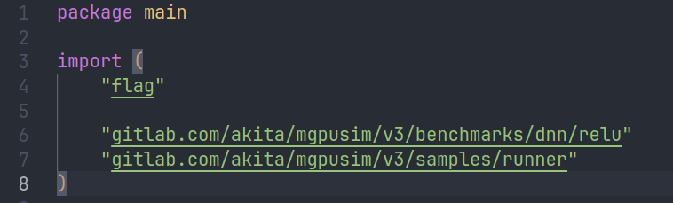
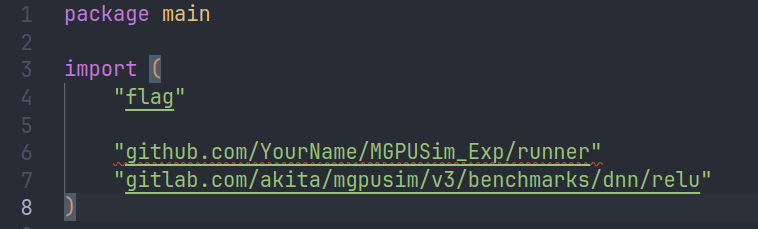

1. 创建实验所需文件夹，例如`MGPUSim_Exp`

```
mkdir -p MGPUSim_Exp
cd MGPUSim_Exp
```

2. 在实验文件夹中创建Go Module

```
go mod init github.com/YourName/MGPUSim_Exp
```

3. 将`MGPUSim`仓库中的`runner`文件夹移入并添加依赖

```
cp -r ../mgpusim/samples/runner ./
go mod tidy
```

4. 使用`sample`中的案例进行实验，以`relu`为例

```
cp -r ../mgpusim/samples/relu ./
cd relu
```


在进行实验之前需要对`relu/main.go`中的依赖进行修改，如下所示





```
go build
/relu -timing --length 65535 --report-all
```

