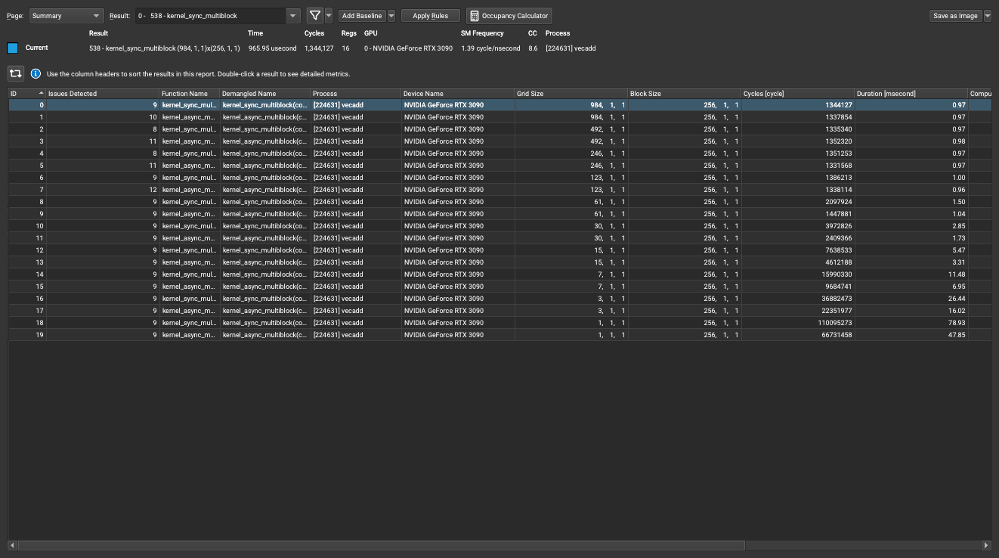
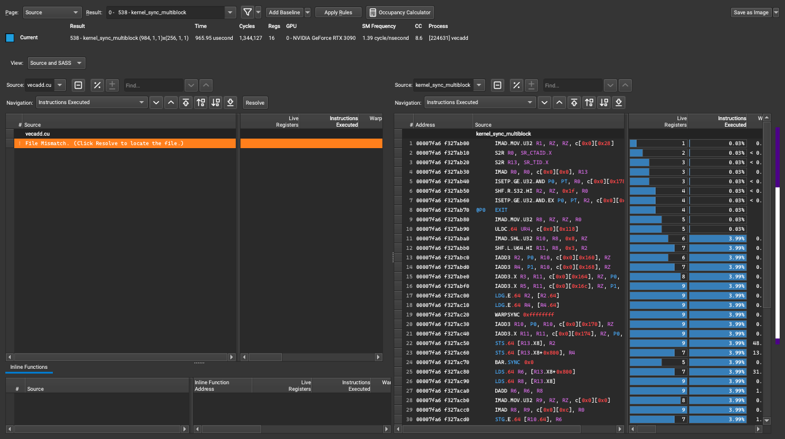
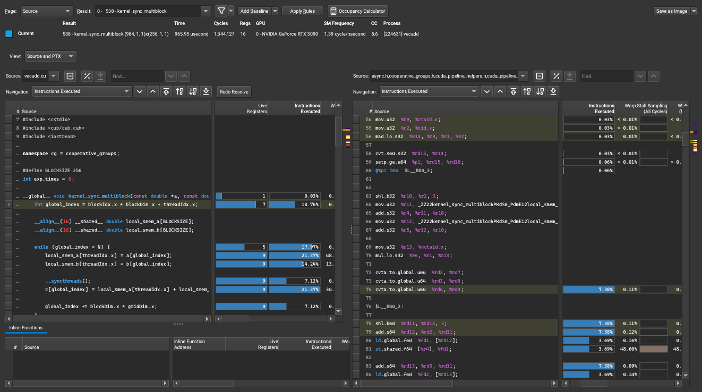
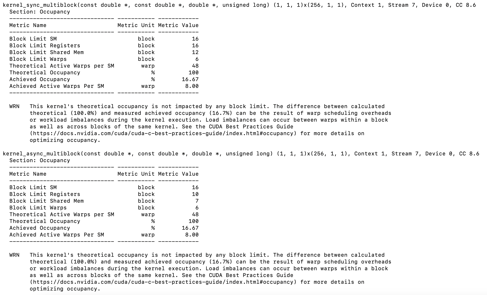
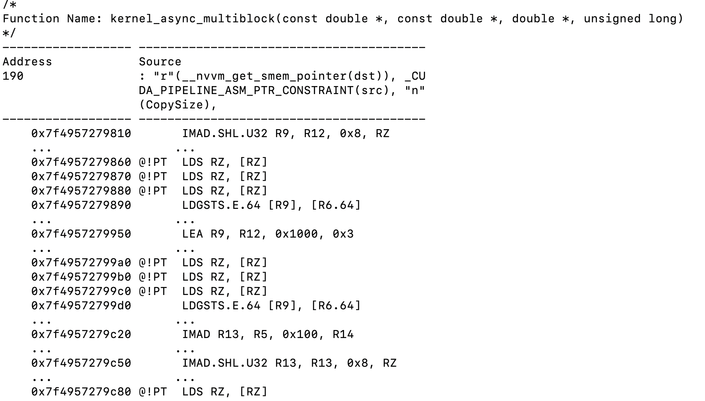

# Nsight Compute

## Nsight Compute UI

> 使用`nvcc`进行编译的文件需要在编译时添加`-lineinfo`或`--generate-line-info`来获取source- level的信息

### 如何生成Report并查看Source与PTX对应关系（以`vecadd`为例）

```
/usr/local/cuda/bin/nvcc -O3 -lineinfo -g -arch=sm_80   vecadd.cu -o vecadd
```

```
/usr/local/cuda/bin/ncu -o profile --set full ./vecadd
```


1. 使用`NVIDIA Nsight Compute`打开`profile.ncu-rep`



2. **Page**选择**Source**



3. **Resolve**选择`vecadd.cu`源文件，**View**选择**Source and PTX**



---

## Nsight Compute CLI

### 如何查看kernel的occupancy

```
/usr/local/cuda/nsight-compute-2022.4.0/ncu --section Occupancy ./vecadd
```




### 如何查看cuda代码对应的sass代码

```
/usr/local/cuda/nsight-compute-2022.4.0/ncu --page source --print-source cuda,sass ./vecadd
```



---

